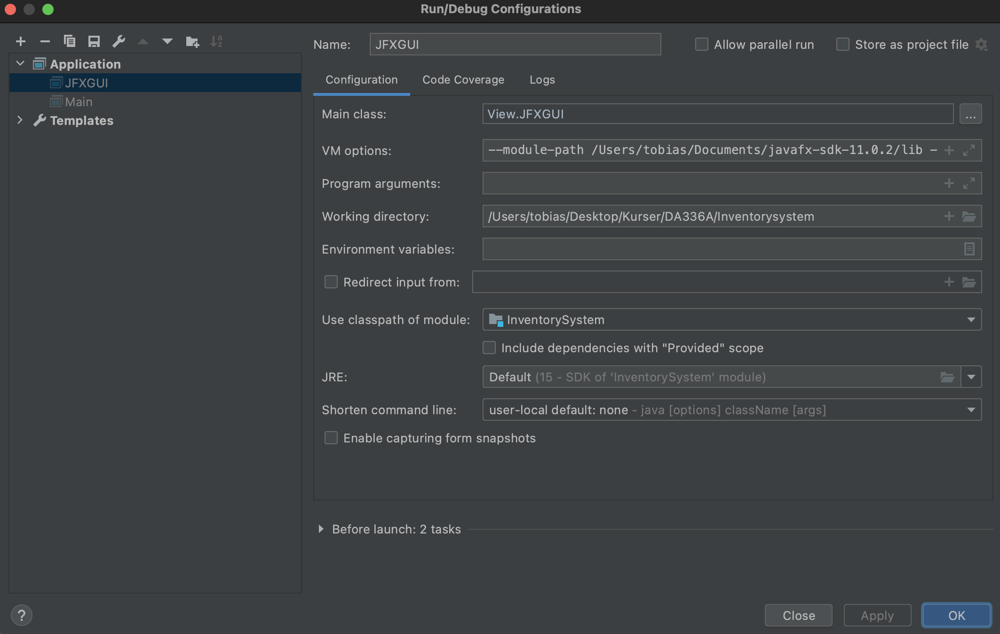

# ECINV

#Link: https://github.com/tobiaslafleur/Inventorysystem.git

## How to run
1. Clone the repository  

   Länk: https://github.com/tobiaslafleur/Inventorysystem.git

2. Download the javafx SDK for your operating system from https://gluonhq.com/products/javafx/  

3. Extract the folder from the zip and save it somewhere easily accessible (ex. Documents)

4. Open the cloned repository with IntelliJ IDEA

5. Go to File -> Project Structure -> Project, and set the project SDK to 15  

6. Go to File -> Project Structure -> Libraries and add the JavaFX 15 SDK as a library to the project. Point to the lib folder of the JavaFX SDK.  

7. Go to Run -> Edit Configurations and write either of the following, depending on your operating system  
  
  

8. Now go to src/java/Controller and run Main.java